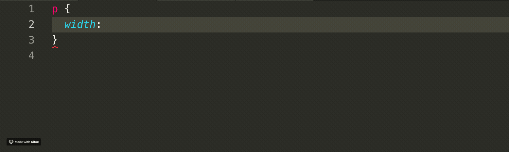

# css-percent

> a vscode snippet plugin for transform __px__ to percent unit(__vw__ , __vh__)

## Features

> **NOTE**: Please set up your extension configuration before you start using it.
> __Configuration takes effect after reloading.__

## Extension Settings

open your vscode setting, search for  `CSS-Percent configration`

For example:

This extension contributes the following settings:

- `CSSPercent.designWidth`: The width of your design, usually by your designer. default is `1920`.
- `CSSPercent.designHeight`: The height of your design, usually by your designer. default is `1080`.
- `CSSPercent.fixedDigits`: Retain decimal places. default is `4`.

## Known Issues

[issue](https://github.com/morehardy/vscode-css-percent/issues)
